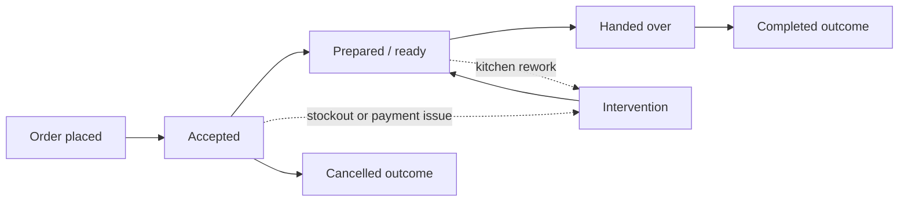
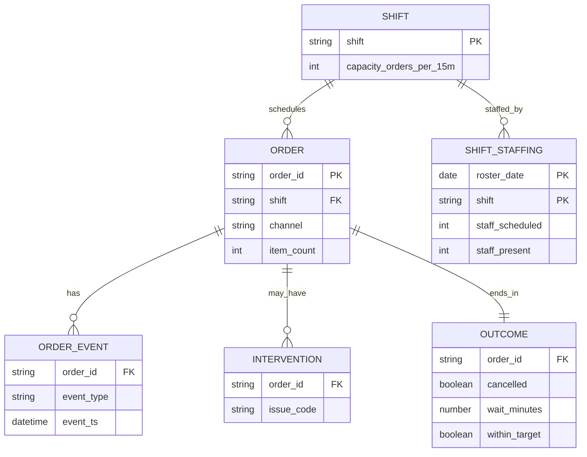

# Workflow and data model

The SQLite artifact (`workflow.db`) has three tables: `orders` (one clean row per order, with stage durations), `shifts` (from `shift_config.json`) and `shift_staffing` (queried from the roster database). Shift metrics join `orders` to `shift_staffing` on (`order_date`, `shift`) to get actual staff-hours, orders per staff-hour and the short-staffed vs fully staffed comparison. Events, interventions and outcomes are stored as columns on the order row because each is one-to-one with an order in this MVP.
